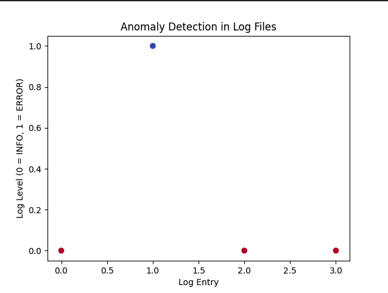

# Anomaly Detection in System Log Files

## Project Description
This project is a simple anomaly detection system that identifies unusual patterns in system log files using machine learning techniques. It uses the Isolation Forest algorithm to detect anomalies based on the log level (e.g., INFO or ERROR). The project can help identify potential system failures or security breaches by flagging unusual log entries.



## Installation
To run this project, you'll need to have Python 3 installed, along with the following libraries:

- pandas
- scikit-learn
- matplotlib

You can install the required dependencies by running:

```bash
pip install pandas scikit-learn matplotlib
```


### 4. **Usage**

```markdown
## Usage
To use the anomaly detection system, follow these steps:

1. Clone the repository or download the script.
2. Prepare your log data, or use the sample data provided in the script.
3. Run the script using the following command:
```

```bash
python3 anomaly_detection.py
```
